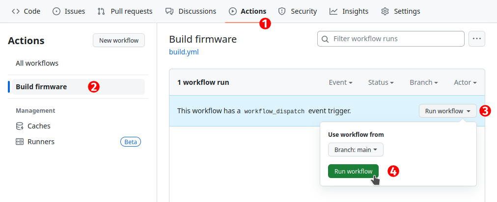
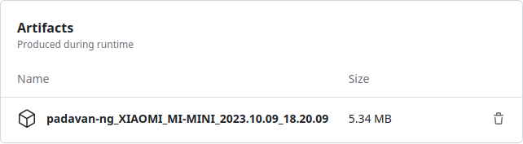
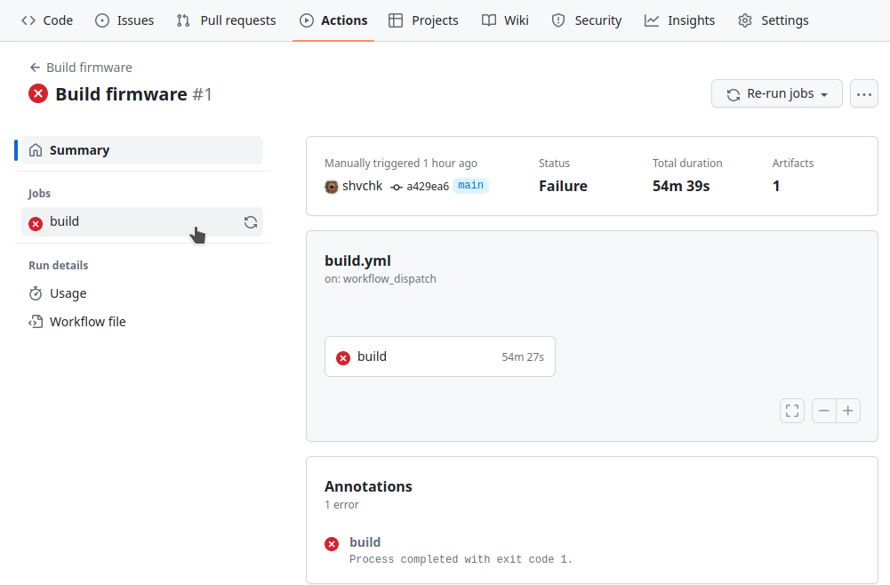
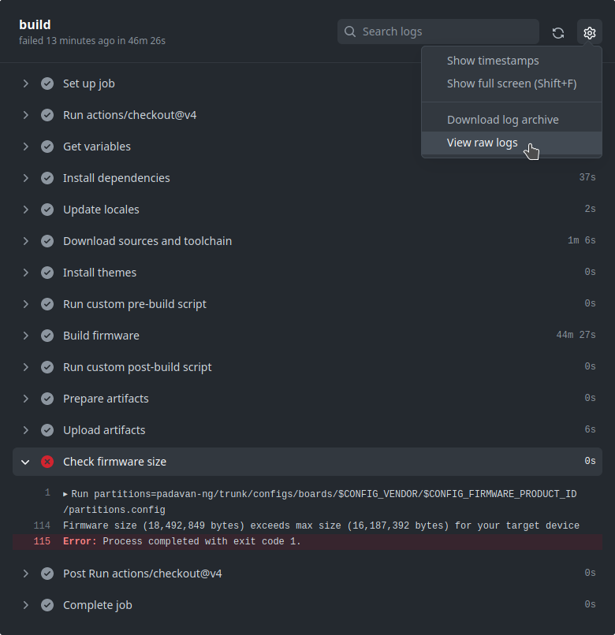

# Mi 3 Padavan firmware builder (auto-updating)

Part of the docker-images-builder-tools monorepo. Based on
[sudtanj/mi3-builder-workflow](https://github.com/sudtanj/mi3-builder-workflow)
(itself derived from shvchk/padavan-builder-workflow), extended to track
upstream automatically.

## Auto-update

[`.github/workflows/mi3-padavan-firmware-builder.yml`](../.github/workflows/mi3-padavan-firmware-builder.yml):

- Every 6 hours it checks the `stable_master` branch of
  [padavan-ng](http://gitlab.com/hadzhioglu/padavan-ng.git).
- If the head differs from `PADAVAN_COMMIT` in [`variables`](variables), it
  commits the new hash to `main` and builds a fresh Xiaomi Mi 3 firmware.
- A manual run (Actions -> Run workflow) or a push touching this folder always builds.
- The firmware is uploaded as an artifact (kept 7 days; the firmware license
  forbids redistributing binaries).

Requires Settings -> Actions -> General -> Workflow permissions -> "Read and write".

This folder has no Dockerfile and is excluded from the Docker publish
workflow (`paths-ignore`); it is handled only by its own workflow.

Customize target/features in [`build.config`](build.config); change branch or
themes in [`variables`](variables).

---

English | <a href="README.ru.md">Русский</a>

## Automatic Padavan firmware builds using GitHub servers

### Usage

- [Fork this repository](https://github.com/shvchk/padavan-builder-workflow/fork), further steps should be performed in your fork

- Copy your build config to [`build.config`](build.config)

  Build config template can be found in the [firmware repository](https://gitlab.com/hadzhioglu/padavan-ng/-/tree/master/trunk/configs/templates)

- Run the build process: [Actions](../../actions) → [Build firmware](../../actions/workflows/build.yml) → Run workflow

  

  The build process will appear on the same page (if it doesn't appear, just refresh the page). You can get process details by clicking on it.

  Depending on the build config, build process usually takes from 10 to 60 minutes.

- While the process is in progress, its status indicator would be gold-ish circle

  

- If the process finishes successfully, its status indicator would turn green with a check mark

  

  Click on the finished process. Archive with the firmware would be stored as its artifact:

  

  Firmware license does not permit binaries distribution, so artifacts are stored for 7 days for personal use.

- If the process finishes with an error, its status indicator would turn red with a cross

  

  Click on the finished process. To get details about the error, click on the failed `build` job at the left:

  

  Job report will be opened:

  

  Here it's immediately obvious that it was *Check firmware size* step that failed — it is marked with a red circle with a cross. Specific reason is shown below: *Firmware size (18,492,849 bytes) exceeds max size (16,187,392 bytes) for your target device* — i.e. built firmware size is too big for the target device.

  In case of any error its reason is usually shown at the end of the log, as in the example above. To view full log click on the cog ⚙️ icon in the top right corner → View raw logs. You can also download compressed log archive in the same menu → Download log archive.

  If you can't figure out the problem on your own, you can ask community or firmware developer for help. In this case don't forget to attach the log archive.

### Updating your fork

To sync your fork with its origin repository, just click *Sync fork* → *Update branch* at the top of the main page of your fork:

### Advanced usage

You can set the firmware repository, branch, specific tag or commit in the [`variables`](variables) file.

In the [`variables`](variables) file you can also specify which themes you want to install by uncommenting theme names in the `PADAVAN_THEMES` variable. Themes repository can be set with the `PADAVAN_THEMES_REPO` variable.

You can create a `pre-build.sh` script with any custom commands, which will be executed just before build process. By that time firmware source code is already downloaded, so you can add or change anything in it.

You can create a `post-build.sh` script, which will be executed right after build process.

---

Discussion: https://github.com/shvchk/padavan-builder-workflow/discussions/categories/general
